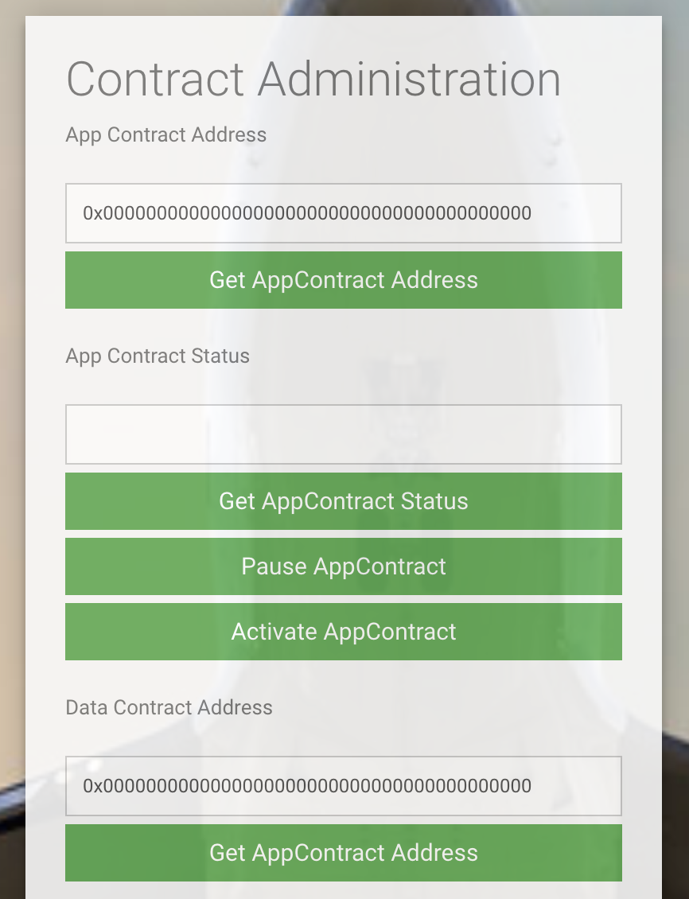
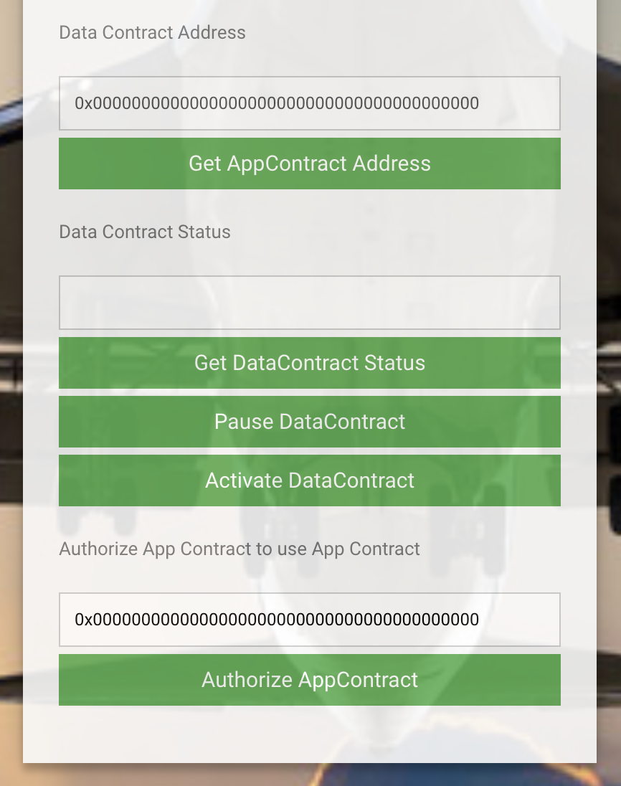
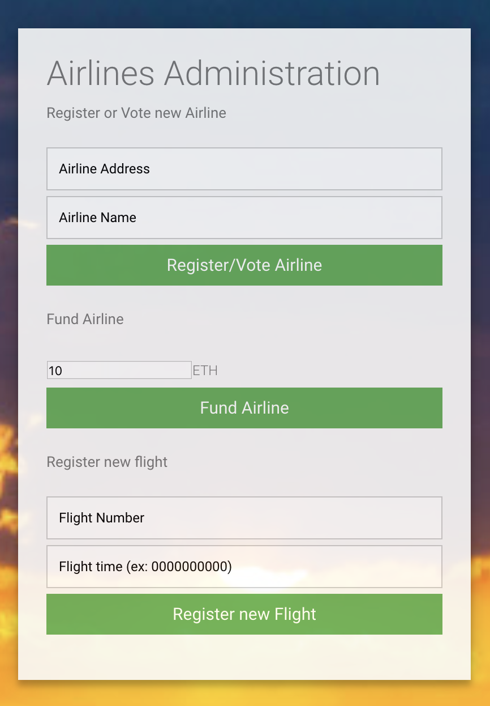
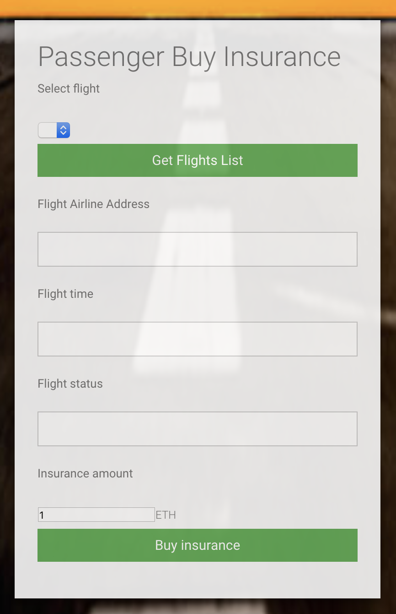
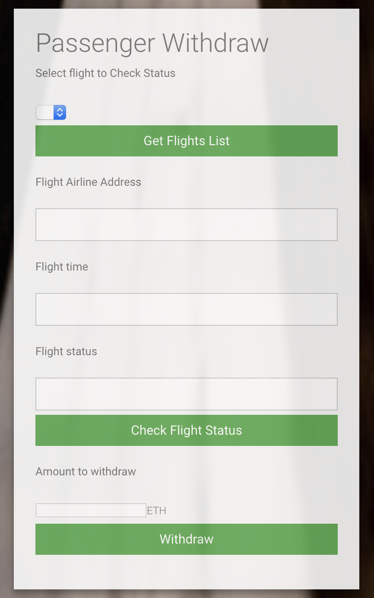

# FlightSurety

FlightSurety is the seventh application project for Udacity's Blockchain NanoDegree course.

## Description
FlightSurety is a smart contract developped in the Ethereum Blockchain using Solidity. Its goal is to automatically manage refunding a passenger who bought a flight insurance if the flight is delayed.
The project requires to use concepts learned in the course:
* Data and Business rules seperation
* Stop loss
* Oracles : how provide information and events comming from outside the blockchain.

### Actors
* Smart contract Owner
* Airline Compagny
* Passenger or client
* multi-party concenssus
* Oracles

## User Interface
### Contract Administration
In this section the App Contract and the DataContract address can be returned by clicking on the  corresponding button.

The Contract owner can pause or activate the Data and/or the App contracts. (Only the contract owner is autorised to change the Data and App contracts status)




### Airline Administration
In this section, the contract owner can register the firt airline compagny. 

#### Register concenssus : 
Only existing airline may register a new airline until there are at least four airlines registered.
Registration of fifth and subsequent airlines requires multi-party concenssus of 50% of registered airlines.
Airline can be registered, but does not participate in contract unti it submits fundinf of at least 10 ether.

An autorized airline compagny (registred + had sent 10 ether to the smart contract) can a add flights to the contracts.



### Passenger Buy Insurance
Passenger may pay unto 1 ether for purchasing a flight insurance. If flight is delayed due to airline fault, passenger receives credit of 1.5X the amount they paid. Funds are transferred from contract to the passenger wallet only when they initiate a withrawal.




### Passenger Withdraw
The passegner chooses a flight from the flights list for which he wants to check the status by clicking the **Chek flight status** button. This button triggers the OracleRequest. If flight is delayed, then the balance of each passenger with insurance is credited and passenger can see his balance/credit on the amount to withdraw. 



## Getting Started

### Libraries

* Truffle v5.0.25 (core: 5.0.25)
* Solidity v0.5.0 (solc-js)
* Node v10.15.3
* Web3.js v1.0.0-beta.37

### Install
1. Clone this repository
```
git clone https://github.com/Abderrazzak87/Flight-Surety-DApp.git
```
2. Install all requisite npm packages:
```
npm init
npm install
```
3. Launch ganache
* 50 accounts each with at least 1000 ether are needed. Accounts 25-49 are used for oracles and 0-9 for contract owner, airlines and passenger.
```
ganache-cli -m "<PUT HERE YOUR WALLET MNEMONIC>" -e 1000 -a 50 -l 9999999 
```
4. Update truffle.js
Update ligne 2 and ligne 8 with your ganache **MNEMONIC** and **RPC SERVER**

5. In a separate terminal window, Compile smart contracts:
```
truffle compile
```
6. Migrate smart contracts to the locally running blockchain, ganache-cli:
```
truffle migrate
```
7. Test smart Data and App contracts:
```
truffle test flightSuretyData.js
truffle test flightSuretyApp.js
truffle test oracles.js
```

## Launching the APP
1. Launch ganache
* 50 accounts each with at least 1000 ether are needed. Accounts 25-49 are used for oracles and 0-9 for contract owner, airlines and passenger.
```
ganache-cli -m "<PUT HERE YOUR WALLET MNEMONIC>" -e 1000 -a 50 -l 9999999 
```
2. Update truffle.js
Update ligne 2 and ligne 8 with your ganache **MNEMONIC** and **RPC SERVER**

3. In a separate terminal window, Compile smart contracts:
```
truffle compile
```
4. Migrate smart contracts to the locally running blockchain, ganache-cli:
```
truffle migrate
```
5. In the same (or a new terminal) launch the dapp
```
npm run dapp
```
6. Start the oracle simulation in a new terminal. At this stage, 25 oracles will be registered and waiting to the FetchFlightStatus event.
```
npm run server
```

## Resources

* [How does Ethereum work anyway?](https://medium.com/@preethikasireddy/how-does-ethereum-work-anyway-22d1df506369)
* [BIP39 Mnemonic Generator](https://iancoleman.io/bip39/)
* [Truffle Framework](http://truffleframework.com/)
* [Ganache Local Blockchain](http://truffleframework.com/ganache/)
* [Remix Solidity IDE](https://remix.ethereum.org/)
* [Solidity Language Reference](http://solidity.readthedocs.io/en/v0.4.24/)
* [Ethereum Blockchain Explorer](https://etherscan.io/)
* [Web3Js Reference](https://github.com/ethereum/wiki/wiki/JavaScript-API)


## Authors

* Abderrazzak BENABDALLAH

## License

The contents of this repository are covered under the [MIT License](LICENSE).